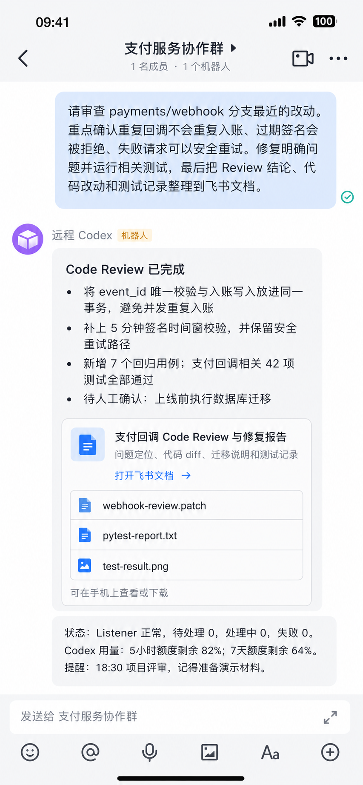

# 飞书掌上 Codex Skill

[English](README_EN.md)

一个可 DIY 的 Codex 手机助手：通过飞书连接桌面端 Codex，可以按个人工作方式自由配置。一句话开始安装，环境已准备好时，目标约 15 分钟完成首次连接；连接后，可以继续调整，让它更适合你的用法。

想在手机上远程使用 Codex，或者不想每次切回 ChatGPT App 都要等重连？这个 Skill 提供了一条简单路径：通过飞书给桌面端 Codex 派任务、收结果，在手机上查看和下载生成的文件，不需要把电脑上的项目暴露到公网，也不需要额外搭建管理后台。

  

## 它能帮你做什么

- 在手机上远程检查代码、修改文件、运行测试或整理资料；
- 连续发送多条想法和要求，让 Codex 按顺序处理；
- 电脑不在身边时，也能直接通过飞书把任务交给 Codex，不必先记在备忘录里；
- 在手机上查看和下载 Codex 在电脑上生成的文件：图片直接显示，明确交付的 PDF、Excel 作为群聊附件发送；简短结果直接回复，长教程和复杂排版使用私有飞书文档；
- 通过对话指令查看消息状态、Codex 用量，或设置后续提醒。

这些是完成安装和连接后的基础功能，不是固定的功能上限。安装后，你仍然可以直接和 Codex 对话，让它调整现有行为、增加适合自己的功能。例如：

- 每天整理并推送行业新闻；
- 在明确团队租户、群成员和本地权限边界后，让同事通过 @ 机器人提交工作问题；
- 为不同项目群设置各自的回复格式、巡检内容、工作约定和定时任务。

这些属于按需 DIY 的扩展，不是默认开启的功能；Codex 会在对应项目、权限和安全边界内完成修改与验证。

## 开始前需要什么

- 一台已经安装并登录 Codex 的 Windows 或 Mac 电脑；
- 一个可以正常使用的飞书账号。首次使用**默认并推荐个人版飞书**，风险最低，也通常不需要团队管理员介入。只有当你的明确目标就是接入某个公司飞书账号下的工作群，并且你接受组织可见性和管理员审批等影响时，才在该团队账号中配置；
- 一个已在桌面端 Codex 中创建、希望通过飞书远程管理的项目。

## 安装

它会尽可能自动配置，但不是完全托管式服务。首次连接可能因飞书账号、权限审批或电脑环境不同，需要你扫码、确认，或按 Codex 提示处理少量卡点。

**模型与权限配置**

安装时建议使用 **GPT-6 Astra**，并**强烈建议开启 Full Access**。推理等级和快速模式按需选择；远程任务首次连接时沿用当前任务的配置，之后可通过对话调整。已有项目的显式模型、推理和加速设置保留，各项目可通过对话指令单独调整。

> **Full Access 风险提示——安装和远程使用均适用：它允许读写本机文件、执行命令，误操作或恶意指令可能影响项目外的数据。请只在可信电脑和项目中使用。可通过对话指令改为“仅项目权限”或“逐次审批”，但部分操作可能需要回到电脑处理；为保持远程任务顺畅，仍强烈建议使用 Full Access。**

### 第一步：把 Skill 交给 Codex

复制下面这句话发给 Codex：

> 安装 https://github.com/ChiyuSONG/feishu-mobile-codex-skill 仓库中的 `skill/feishu-codex-remote` Skill。

也可以手动将 [`skill/feishu-codex-remote`](skill/feishu-codex-remote) 复制到 Codex Skills 目录，然后重启或刷新 Codex。不要把整个仓库复制成一个 Skill。

### 第二步：一句话连接飞书

在 Codex 中找到你想通过飞书远程管理的项目，打开其中一个对话，发送：

> 使用 `$feishu-codex-remote`，把当前项目连接到我的飞书。尽可能自动完成，只在需要我扫码、登录或授权时提醒我。

**配置期间请尽量不要操作电脑**：Codex 会通过 CUA（电脑界面自动操作）配置浏览器和飞书，可能暂时接管鼠标和键盘。

你通常只需要按提示：

1. 扫码或登录飞书；
2. 确认开发者后台当前选中的是你准备使用的飞书账号；
3. 同意消息、图片/文件和私有文档所需权限；
4. 必要时复制一次飞书应用凭证；
5. 首次启动时确认一次 Codex 的安全提示；
6. 如果电脑缺少运行环境，按提示确认安装 Python 3.10 或更高版本等必要依赖。

在飞书中收到测试图片和欢迎消息，即完成连接。

## 在飞书里怎么用

直接像平时和 Codex 对话一样发消息：

- `检查最近的代码改动，修复发现的问题并运行测试，把结果发给我。`
- `# 顺便根据刚才讨论的需求，单独整理一份验收清单，不用等代码改完。`
- `* 每周五下午 5 点提醒我交周报，直到我说已经提交。`

你可以在同一个飞书群里连续发消息，Codex 会结合上下文，自动识别哪些是同一任务的补充并合并处理，不同任务则排队串行处理。消息开头加 `*`，表示这个任务需要单独处理，不自动与前面的消息合并；加 `#` 可继承当前对话上下文，开启独立上下文并立即并行处理。默认每小时自动巡检连接和任务状态。电脑或 Codex 关闭时不会执行任务，但暂存在飞书的消息不会丢失，下次打开 Codex 后会自动继续处理。

## 常见问题

### 支持哪些手机？

苹果手机（iPhone）、安卓手机和华为鸿蒙手机都可通过飞书使用，无需安装 ChatGPT App。手机能正常使用飞书即可；电脑端需完成连接，并保持 Codex 运行和网络畅通。

### 使用飞书后，还需要在手机上安装 ChatGPT 吗？

不需要。通过本工具派任务、收结果只需使用手机上的飞书，不依赖 ChatGPT 手机 App。这并不免除电脑端的 Codex 安装、登录和网络要求。

### 电脑和 Codex 需要一直开着吗？

如果希望任务及时处理，就需要让电脑开机，并保持 Codex 运行。电脑或 Codex 关闭后，飞书仍会接收新消息并把它们保留为待处理，但不会执行任务；下次打开 Codex 后才会继续处理。

### 修改飞书群名会断开连接吗？

不会。连接不依赖群名。

### 可以连接多个项目吗？

可以。一个飞书群固定对应电脑上的一个项目，不同项目使用不同群，避免上下文混在一起。

### 发错消息后，可以直接编辑或撤回吗？

不要依赖编辑或撤回来更正或取消已入队的任务。请另发一条新消息说明更正，例如：`更正上一条：只修改 README，不改代码。` 如果上一项任务已经开始，新消息会排到下一轮处理，不能实时改变正在运行的那一轮，也不会自动撤销已经完成的操作。

### 手机上怎么看、下载 Codex 在电脑上生成的文件？

让 Codex 把生成的文件发到飞书即可。图片会直接显示在群里，明确交付的 PDF、Excel 会作为附件发送，手机上即可查看或下载，不必回到电脑前另行上传。简单回复直接发在群里，较长或结构复杂的内容使用私有飞书文档；图片或附件发送失败时会明确提示。

## 卸载

不需要运行命令，直接对 Codex 说：

> 卸载飞书掌上 Codex Skill。保留飞书对话和文档，先告诉我会移除什么，然后自动完成。

Codex 会先列出准备移除的内容，确认后再卸载，不影响其他 Codex 任务，也不会删除飞书对话、群聊或已经生成的飞书文档。

默认保留一份恢复备份。如果还要删除本地凭据、缓存和历史状态，请明确补充：`同时清除全部本地数据`。

## 隐私与安全

- 默认 Full Access 只代表本地执行能力，不代表可以跨项目工作；可随时通过对话指令降为仅项目权限或逐次审批；
- 不需要把电脑上的项目开放到公网；
- 飞书凭证保存在仓库之外；
- 生成的飞书文档会关闭公开链接分享并验证设置；
- 每个群只连接你明确选择的电脑上的项目；
- 仓库不保存你的凭据、对话、项目路径或运行记录。

更多说明请参阅 [SECURITY.md](SECURITY.md)。

## License

采用 [MIT License](LICENSE)，允许个人使用、商业使用、修改和再分发；再分发时需要保留许可证和版权声明。

这是非官方社区项目，与 OpenAI 或飞书不存在隶属或官方合作关系。
